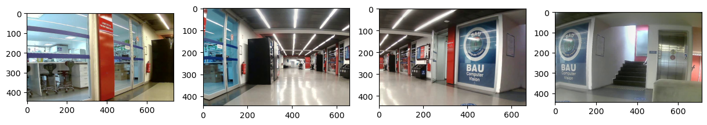

# Digital Image Process Final Project

- Forked from [OpenStitching/stitching_tutorial](https://github.com/OpenStitching/stitching_tutorial)
- This is the new README after modifying the project

## My Revision

- The images I need to stitch are actually videos of an office took from 4 cameras with different aspects, and I need to stitch these four videos into one. Since the 4 cameras are static, in my opinion, I only have to grab out their first frames, stitch them, then extract the stitching information, and apply to all the video. See the videos here: [lab1](./testolabc1.avi), [lab2](./testolabc2.avi),[lab3](./testolabc3.avi) and [lab4](./testolabc4.avi). And the images of their first frame are shown below.

- For original tutorial and instructions, see [this markdown file](./README_original.md) and [this jupyter notebook](./Stitching%20Tutorial.ipynb)
- The new jupyter notebook file for my case is [here](./Stitching_Tutorial_Mine.ipynb). I just copy the original procedure, change the images and parameters. For the images I need to stitch, the feature detector 'orb' doesn't work, so I have to change it to 'brisk'.
- Since I don't need the process after 'Blending' block, I didn't run it or check it, also maybe remove the resources it needs accidentally.
- The final code is [here](./runMe.py)

## More Details

- There are some other codes in the folder[preprocessing](./pre_processing/). The most important one is the [undistort function](./pre_processing/Undistort.py).
